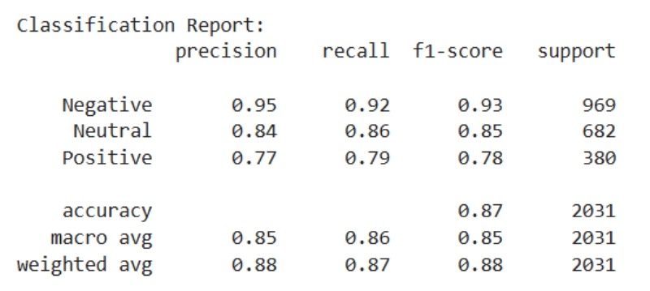
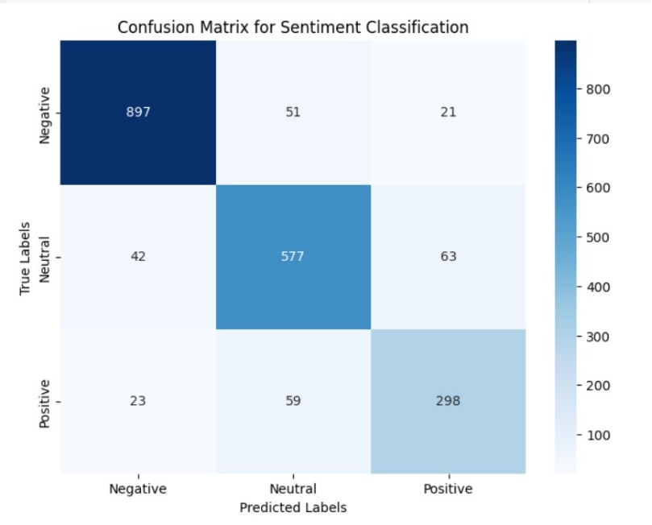
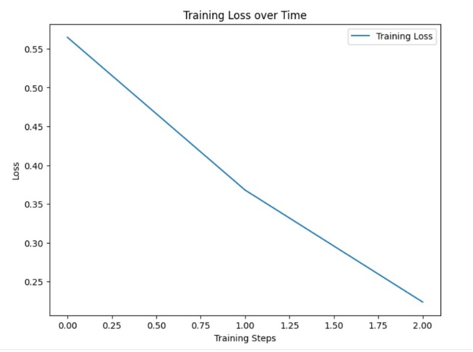
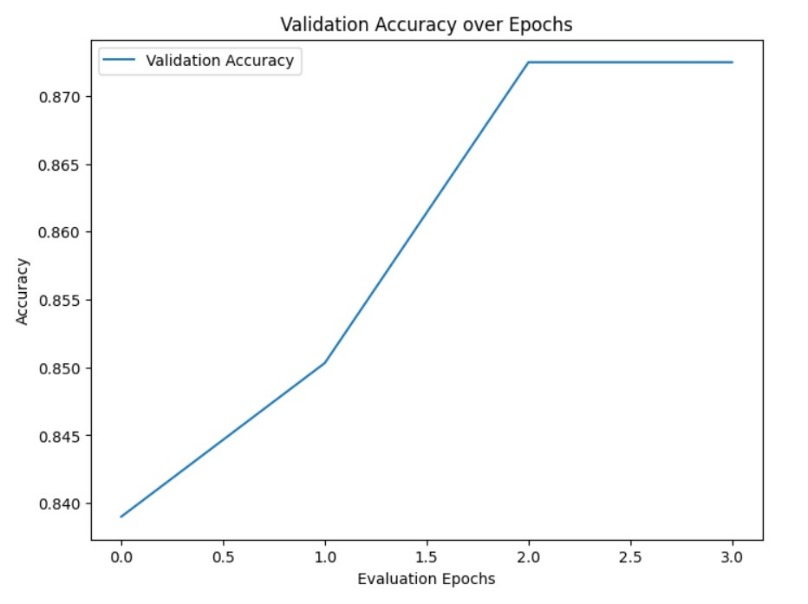
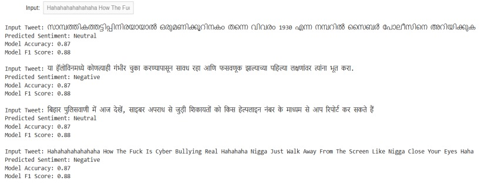

# Multilingual Cyberbullying Detection

A machine learning project to detect cyberbullying across multiple languages using mBERT (Multilingual BERT) and sentiment analysis. This project focuses on providing a context-aware and language-agnostic solution for detecting harmful online behavior in Hindi, Marathi, and Malayalam.

# Table of Contents

- [Introduction](#introduction)
- [Screenshots](#screenshots)
- [Features](#features)
- [Project Architecture](#project-architecture)
- [Datasets](#datasets)
- [Running](#running)
- [Preprocessing](#preprocessing)
- [Model](#model)
- [Evaluation Metrics](#evaluation-metrics)
- [Installation](#installation)
- [Usage](#usage)
- [Future Work](#future-work)
- [Authors](#authors)

## Screenshots

